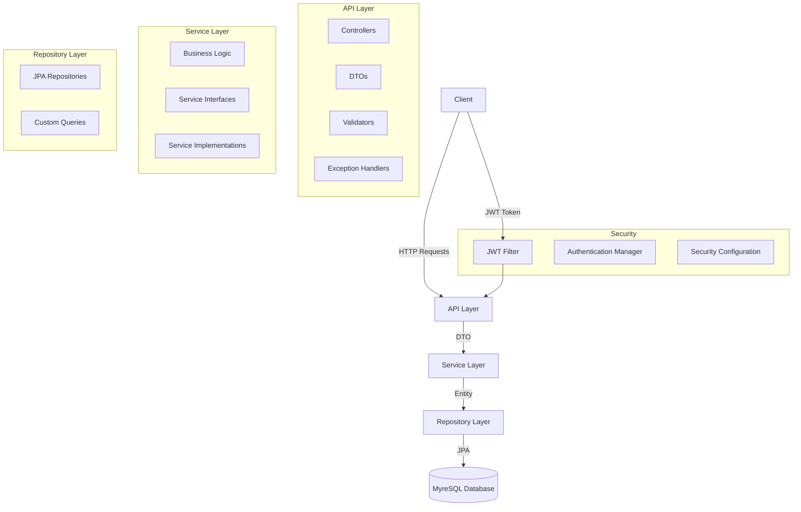
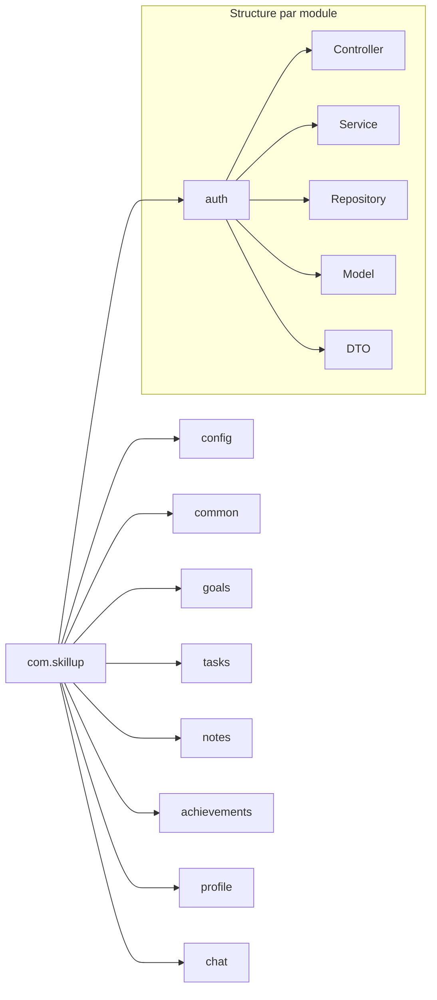
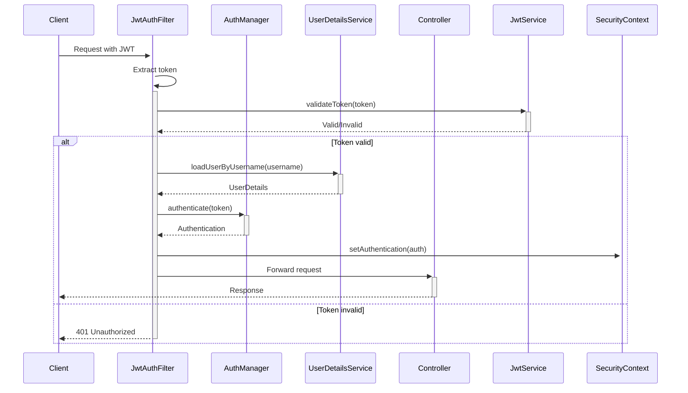
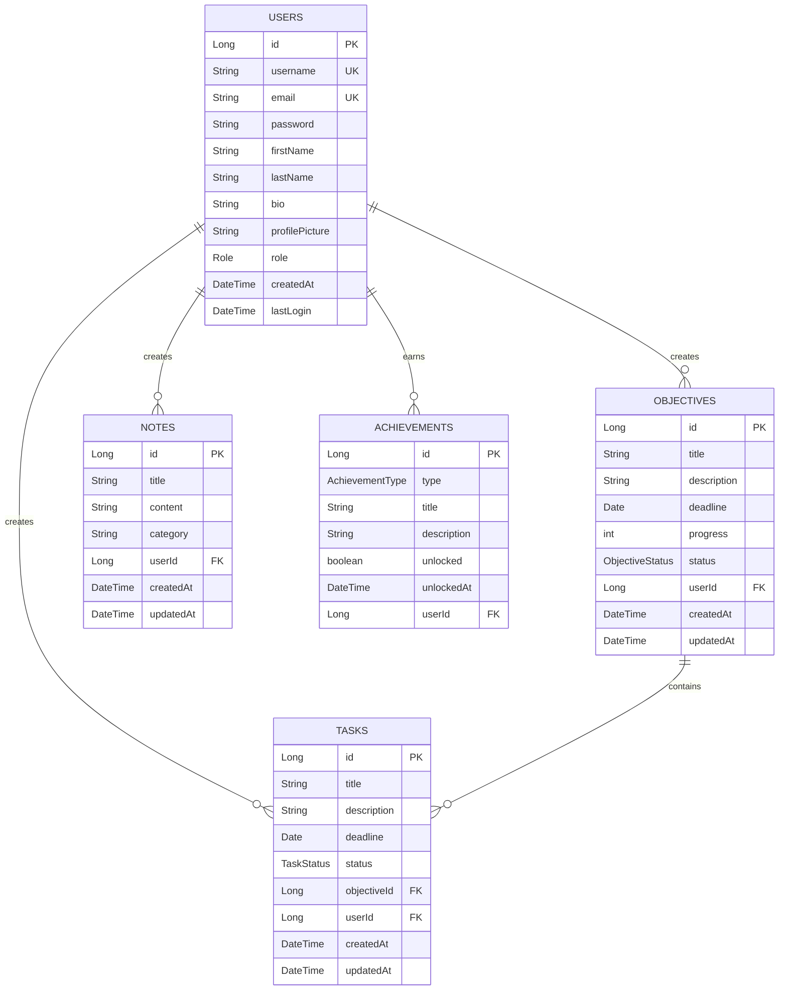

# Architecture Technique du Backend Skill-Up

*Développé par : Cheikh Ahmed Tidiane Thiandoum & Awaa Ndiaye*

## Vue d'ensemble

Le backend de Skill-Up est construit sur une architecture moderne et modulaire, utilisant Spring Boot comme framework principal. Cette architecture permet une maintenance facile, une évolutivité et une séparation claire des responsabilités.

## Architecture Globale



## Organisation du Code

Le code est organisé selon une structure modulaire par domaine, où chaque domaine fonctionnel (auth, goals, tasks, etc.) contient ses propres contrôleurs, services, repositories et modèles.



## Couches Architecturales

### 1. Couche API (Contrôleurs)

La couche API est responsable de la gestion des requêtes HTTP, de la validation des entrées et de la transformation des objets métier en DTOs.

```java
@RestController
@RequestMapping("/api/goals")
@RequiredArgsConstructor
public class GoalController {
    private final GoalService goalService;
    
    @GetMapping
    public ResponseEntity<List<GoalDTO>> getAllGoals() {
        // ...
    }
    
    @PostMapping
    public ResponseEntity<GoalDTO> createGoal(@Valid @RequestBody GoalRequest request) {
        // ...
    }
    
    // Autres endpoints...
}
```

### 2. Couche Service

La couche service contient la logique métier de l'application. Elle est responsable de l'orchestration des opérations, de la validation des règles métier et de la coordination entre les différents repositories.

```java
@Service
@RequiredArgsConstructor
public class GoalServiceImpl implements GoalService {
    private final GoalRepository goalRepository;
    private final TaskRepository taskRepository;
    
    @Override
    public Goal createGoal(GoalRequest request, User user) {
        // Logique métier pour créer un objectif
        // ...
    }
    
    // Autres méthodes...
}
```

### 3. Couche Repository

La couche repository est responsable de l'accès aux données et de l'interaction avec la base de données.

```java
@Repository
public interface GoalRepository extends JpaRepository<Goal, Long> {
    List<Goal> findByUser(User user);
    Optional<Goal> findByIdAndUser(Long id, User user);
    long countByUser(User user);
    long countByUserAndStatus(User user, GoalStatus status);
}
```

### 4. Couche Modèle

La couche modèle définit les entités JPA qui sont mappées aux tables de la base de données.

```java
@Entity
@Table(name = "goals")
@Data
@NoArgsConstructor
@AllArgsConstructor
public class Goal {
    @Id
    @GeneratedValue(strategy = GenerationType.IDENTITY)
    private Long id;
    
    @NotBlank
    private String title;
    
    private String description;
    
    private LocalDate deadline;
    
    private int progress = 0;
    
    @Enumerated(EnumType.STRING)
    private GoalStatus status = GoalStatus.EN_COURS;
    
    @ManyToOne
    @JoinColumn(name = "user_id", nullable = false)
    private User user;
    
    // Autres champs...
}
```

## Sécurité

La sécurité est gérée via Spring Security et JWT (JSON Web Tokens).



## Gestion des Exceptions

Un système centralisé de gestion des exceptions est mis en place pour traiter les erreurs de manière cohérente.

```java
@RestControllerAdvice
public class GlobalExceptionHandler {
    
    @ExceptionHandler(ResourceNotFoundException.class)
    public ResponseEntity<ErrorResponse> handleResourceNotFoundException(ResourceNotFoundException ex) {
        ErrorResponse error = new ErrorResponse(
            HttpStatus.NOT_FOUND.value(),
            ex.getMessage(),
            LocalDateTime.now()
        );
        return new ResponseEntity<>(error, HttpStatus.NOT_FOUND);
    }
    
    @ExceptionHandler(UnauthorizedException.class)
    public ResponseEntity<ErrorResponse> handleUnauthorizedException(UnauthorizedException ex) {
        // ...
    }
    
    @ExceptionHandler(ValidationException.class)
    public ResponseEntity<ErrorResponse> handleValidationException(ValidationException ex) {
        // ...
    }
    
    // Autres handlers...
}
```

## Base de Données

MySQL est utilisé comme système de gestion de base de données relationnelle. Le schéma de la base de données est géré via Hibernate/JPA.



## Configuration

La configuration de l'application est gérée via des fichiers de propriétés et des classes de configuration Spring.


### SecurityConfig

```java
@Configuration
@EnableWebSecurity
@RequiredArgsConstructor
public class SecurityConfig {
    private final JwtAuthenticationFilter jwtAuthFilter;
    private final UserDetailsService userDetailsService;
    
    @Bean
    public SecurityFilterChain securityFilterChain(HttpSecurity http) throws Exception {
        http
            .csrf().disable()
            .authorizeHttpRequests()
            .requestMatchers("/api/auth/**").permitAll()
            .anyRequest().authenticated()
            .and()
            .sessionManagement()
            .sessionCreationPolicy(SessionCreationPolicy.STATELESS)
            .and()
            .authenticationProvider(authenticationProvider())
            .addFilterBefore(jwtAuthFilter, UsernamePasswordAuthenticationFilter.class);
        
        return http.build();
    }
    
    @Bean
    public AuthenticationProvider authenticationProvider() {
        DaoAuthenticationProvider authProvider = new DaoAuthenticationProvider();
        authProvider.setUserDetailsService(userDetailsService);
        authProvider.setPasswordEncoder(passwordEncoder());
        return authProvider;
    }
    
    @Bean
    public PasswordEncoder passwordEncoder() {
        return new BCryptPasswordEncoder();
    }
    
    // Autres beans...
}
```

## Conclusion

L'architecture du backend Skill-Up est conçue pour être modulaire, maintenable et évolutive. La séparation claire des responsabilités entre les différentes couches facilite le développement et les tests. L'utilisation de Spring Boot et de ses écosystèmes (Spring Security, Spring Data JPA) permet de se concentrer sur la logique métier tout en bénéficiant d'une infrastructure solide et éprouvée.

*Document finalisé le 28 mai 2025*
