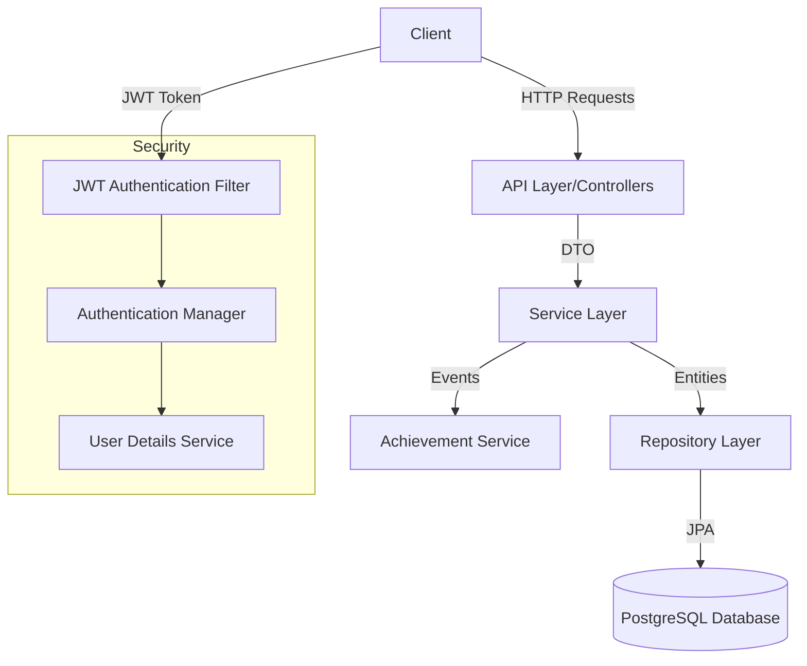
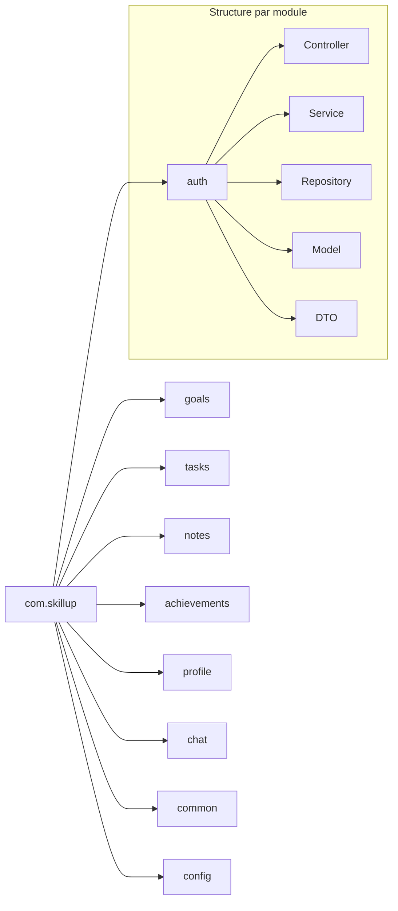
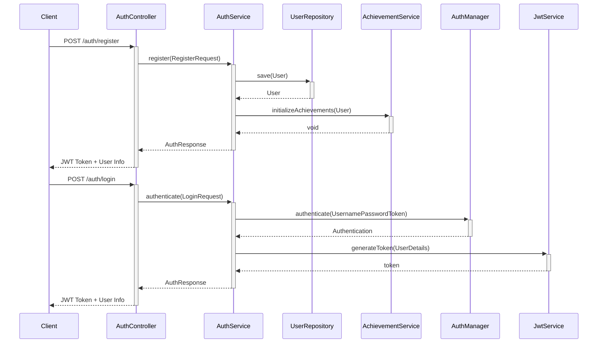
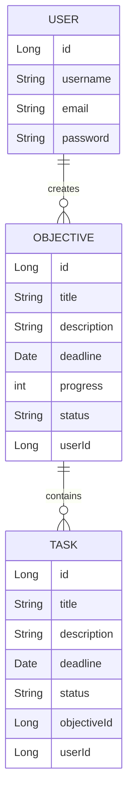
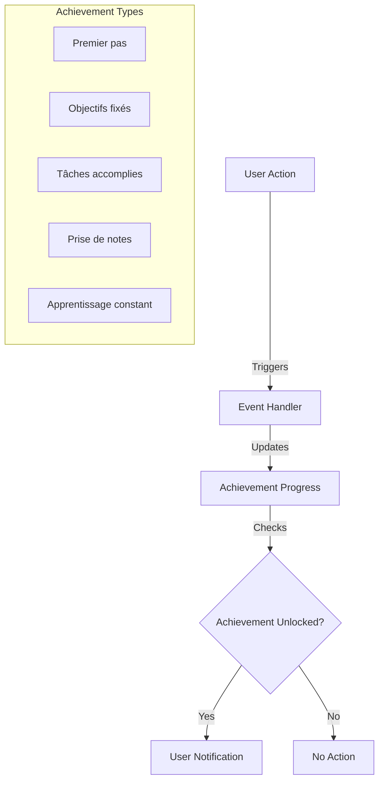

# Rapport Technique - Backend Skill-Up

*Rapport rédigé par :*
- **Cheikh Ahmed Tidiane Thiandoum** - Lead Backend
- **Awaa Ndiaye** - Développeuse Backend

## Résumé du Projet

Le backend de Skill-Up est une application Spring Boot qui fournit une API RESTful pour gérer une plateforme de développement personnel et d'apprentissage. Développé en moins d'une semaine, ce projet implémente plusieurs fonctionnalités clés comme la gestion des objectifs, des tâches, des notes, un système d'authentification sécurisé, et un système d'achievements pour motiver les utilisateurs.

## Architecture Globale

## Organisation du Code

## Progression par Sprints

### Sprint 1 : Fondation et Authentification

*Durée : 2 jours*

#### Objectifs :
- Mise en place de l'architecture de base
- Implémentation du système d'authentification
- Configuration de la sécurité avec JWT

#### Réalisations :
- Configuration du projet Spring Boot avec les dépendances nécessaires
- Mise en place de la base de données PostgreSQL
- Implémentation du système d'authentification (inscription, connexion)
- Configuration de la sécurité avec JWT
- Mise en place des contrôleurs REST de base

#### Diagramme d'authentification :

### Sprint 2 : Gestion des Objectifs et Tâches

*Durée : 2 jours*

#### Objectifs :
- Implémentation du système de gestion des objectifs
- Implémentation du système de gestion des tâches
- Liaison entre objectifs et tâches

#### Réalisations :
- Création des modèles, repositories, services et contrôleurs pour les objectifs
- Création des modèles, repositories, services et contrôleurs pour les tâches
- Implémentation des fonctionnalités CRUD pour les objectifs et tâches
- Mise en place du suivi de progression des objectifs
- Intégration avec le système d'achievements

#### Diagramme de relation Objectifs-Tâches :

### Sprint 3 : Système de Notes et Achievements

*Durée : 2 jours*

#### Objectifs :
- Implémentation du système de prise de notes
- Développement du système d'achievements
- Finalisation et tests

#### Réalisations :
- Création des modèles, repositories, services et contrôleurs pour les notes
- Implémentation du système d'achievements avec les règles métier
- Intégration des achievements avec les autres services
- Tests et corrections de bugs
- Documentation de l'API

#### Système d'Achievements :

## Détails Techniques par Service

### Service d'Authentification

Le service d'authentification gère l'inscription et la connexion des utilisateurs. Il utilise JWT (JSON Web Tokens) pour l'authentification stateless.

**Points clés :**
- Encodage sécurisé des mots de passe avec BCrypt
- Génération et validation des tokens JWT
- Initialisation automatique des achievements lors de l'inscription

### Service de Gestion des Objectifs

Ce service permet aux utilisateurs de créer et gérer leurs objectifs personnels ou professionnels.

**Fonctionnalités :**
- Création, lecture, mise à jour et suppression d'objectifs
- Suivi de la progression des objectifs
- Changement de statut (EN_COURS, TERMINÉ, ABANDONNÉ)
- Liaison avec les tâches associées

### Service de Gestion des Tâches

Le service de tâches permet de décomposer les objectifs en tâches plus petites et gérables.

**Fonctionnalités :**
- Création, lecture, mise à jour et suppression de tâches
- Changement de statut des tâches (À_FAIRE, EN_COURS, TERMINÉE)
- Impact automatique sur la progression de l'objectif parent
- Déclenchement d'achievements lorsque des tâches sont terminées

### Service de Notes

Ce service permet aux utilisateurs de prendre des notes pour documenter leur apprentissage.

**Fonctionnalités :**
- Création, lecture, mise à jour et suppression de notes
- Organisation des notes par catégories
- Recherche de notes par mots-clés
- Déclenchement d'achievements basé sur le nombre de notes créées

### Service d'Achievements

Le système d'achievements est conçu pour motiver les utilisateurs en récompensant leurs actions sur la plateforme.

**Achievements implémentés :**
- "Premier pas" : Débloqué automatiquement lors de l'inscription
- "Objectifs fixés" : Débloqué lorsque l'utilisateur crée son premier objectif
- "Tâches accomplies" : Débloqué lorsque l'utilisateur complète 5 tâches
- "Prise de notes" : Débloqué lorsque l'utilisateur crée 10 notes
- "Apprentissage constant" : Débloqué lorsque l'utilisateur se connecte 7 jours de suite

**Architecture :**
- `AchievementProgressService` : Service central qui gère le suivi et la mise à jour des achievements
- Méthodes de comptage dans les repositories pour suivre les actions des utilisateurs
- Intégration avec les services existants (GoalService, TaskService, NoteService, AuthService)
- Endpoint pour rafraîchir manuellement les achievements

## Défis et Solutions

### Défi 1 : Développement Rapide
**Solution :** Utilisation d'une architecture modulaire et de Spring Boot pour accélérer le développement.

### Défi 2 : Intégration des Achievements
**Solution :** Conception d'un système d'événements pour déclencher les mises à jour d'achievements sans couplage fort entre les services.

### Défi 3 : Sécurité
**Solution :** Implémentation d'une authentification JWT robuste avec validation des tokens et gestion des rôles.

## Conclusion et Perspectives

Le backend de Skill-Up a été développé en un temps record tout en maintenant une architecture solide et évolutive. Les prochaines étapes pourraient inclure :

- Amélioration des performances avec mise en cache
- Ajout de fonctionnalités sociales (partage d'objectifs, collaboration)
- Implémentation d'un système de notifications
- Intégration avec des services externes (calendriers, applications de productivité)

*Rapport finalisé le 28 mai 2025*
