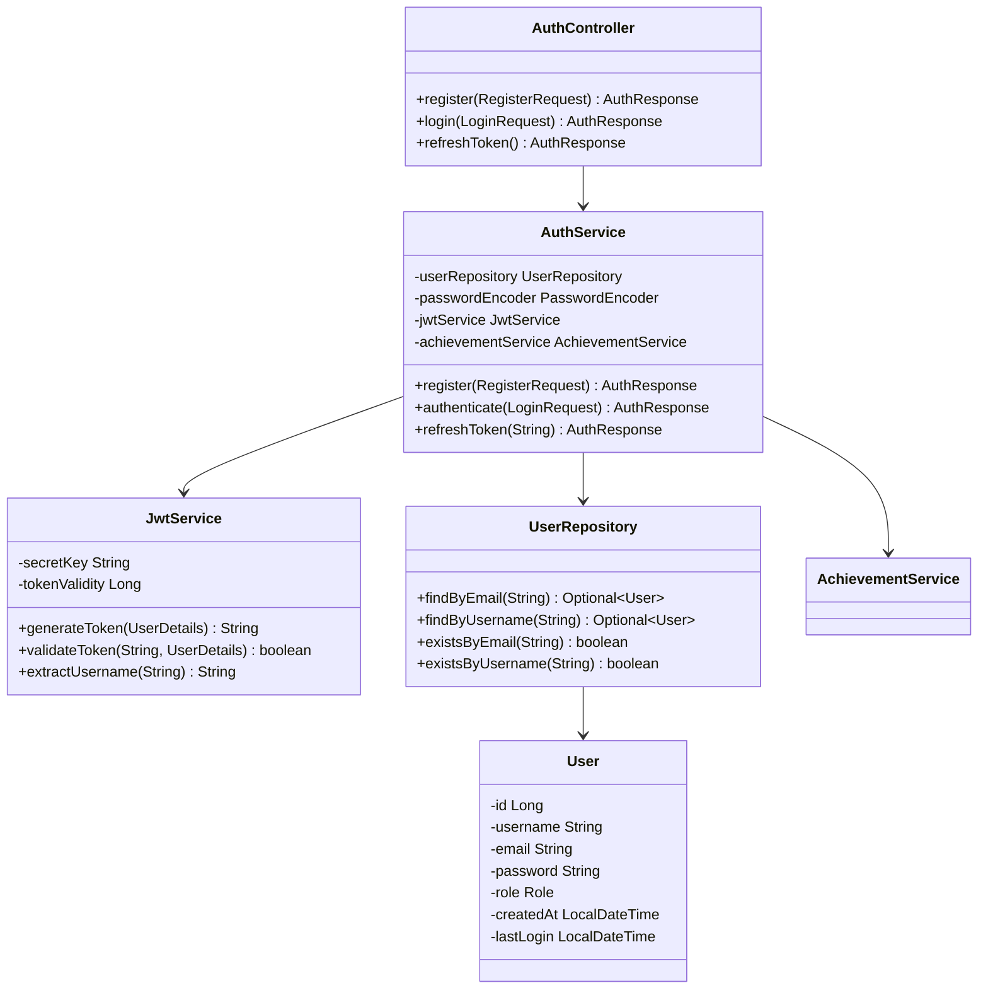
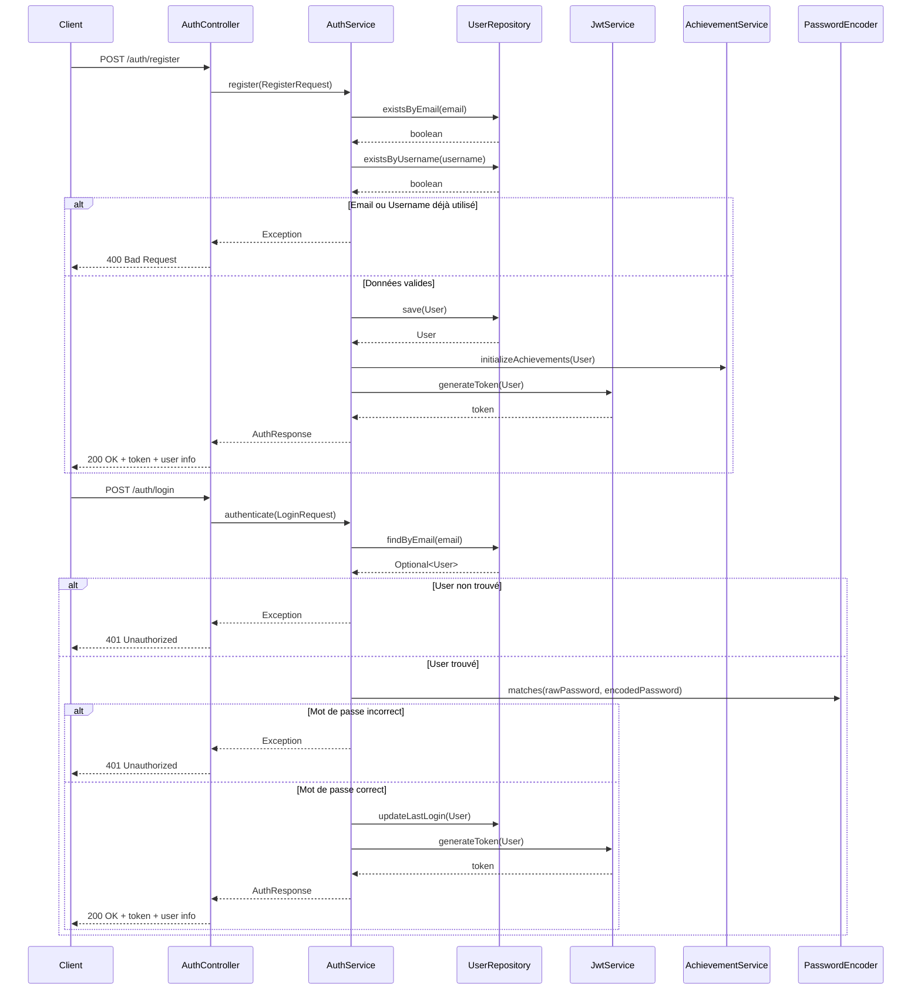

# Service d'Authentification

*Développé par : Cheikh Ahmed Tidiane Thiandoum & Awaa Ndiaye*

## Vue d'ensemble

Le service d'authentification est la porte d'entrée de l'application Skill-Up. Il gère l'inscription des utilisateurs, leur connexion, et la sécurisation des endpoints de l'API via JWT (JSON Web Tokens).

## Architecture



## Flux d'Authentification



## Points Clés d'Implémentation

### Sécurité des Mots de Passe

Les mots de passe sont encodés avec BCrypt avant d'être stockés en base de données :

```java
@Bean
public PasswordEncoder passwordEncoder() {
    return new BCryptPasswordEncoder();
}
```

### Génération de JWT

Les tokens JWT contiennent les informations essentielles de l'utilisateur et ont une durée de validité configurable :

```java
public String generateToken(UserDetails userDetails) {
    Map<String, Object> claims = new HashMap<>();
    if (userDetails instanceof User) {
        User user = (User) userDetails;
        claims.put("id", user.getId());
        claims.put("role", user.getRole());
    }
    
    return Jwts.builder()
            .setClaims(claims)
            .setSubject(userDetails.getUsername())
            .setIssuedAt(new Date(System.currentTimeMillis()))
            .setExpiration(new Date(System.currentTimeMillis() + tokenValidity))
            .signWith(getSigningKey(), SignatureAlgorithm.HS256)
            .compact();
}
```

### Validation des Tokens

Chaque requête à un endpoint protégé passe par un filtre qui valide le token JWT :

```java
@Component
public class JwtAuthenticationFilter extends OncePerRequestFilter {
    // ...
    @Override
    protected void doFilterInternal(
            HttpServletRequest request,
            HttpServletResponse response,
            FilterChain filterChain
    ) throws ServletException, IOException {
        final String authHeader = request.getHeader("Authorization");
        
        if (authHeader == null || !authHeader.startsWith("Bearer ")) {
            filterChain.doFilter(request, response);
            return;
        }
        
        final String jwt = authHeader.substring(7);
        final String username = jwtService.extractUsername(jwt);
        
        if (username != null && SecurityContextHolder.getContext().getAuthentication() == null) {
            UserDetails userDetails = userDetailsService.loadUserByUsername(username);
            
            if (jwtService.validateToken(jwt, userDetails)) {
                // Configure l'authentification dans le contexte de sécurité
                // ...
            }
        }
        
        filterChain.doFilter(request, response);
    }
}
```

### Intégration avec le Système d'Achievements

Lors de l'inscription, les achievements de l'utilisateur sont initialisés :

```java
@Override
public AuthResponse register(RegisterRequest request) {
    // Validation et création de l'utilisateur
    // ...
    
    User savedUser = userRepository.save(user);
    
    // Initialisation des achievements
    achievementService.initializeAchievements(savedUser);
    
    // Génération du token
    // ...
}
```

## Endpoints API

| Méthode | Endpoint | Description | Paramètres | Réponse |
|---------|----------|-------------|------------|---------|
| POST | `/api/auth/register` | Inscription d'un nouvel utilisateur | `username`, `email`, `password` | JWT token + infos utilisateur |
| POST | `/api/auth/login` | Connexion d'un utilisateur | `email`, `password` | JWT token + infos utilisateur |
| POST | `/api/auth/refresh` | Rafraîchissement du token | Token dans l'en-tête Authorization | Nouveau JWT token |

## Défis et Solutions

### Défi : Sécurité des Tokens

**Solution :** Utilisation d'une clé secrète robuste stockée dans les variables d'environnement et rotation régulière des tokens.

### Défi : Gestion des Sessions

**Solution :** Implémentation d'une approche stateless avec JWT, tout en maintenant un suivi des connexions pour l'achievement "Apprentissage constant".

## Améliorations Futures

1. Authentification à deux facteurs
2. Support de l'authentification OAuth2 (Google, GitHub, etc.)
3. Système de récupération de mot de passe
4. Blacklisting des tokens révoqués
