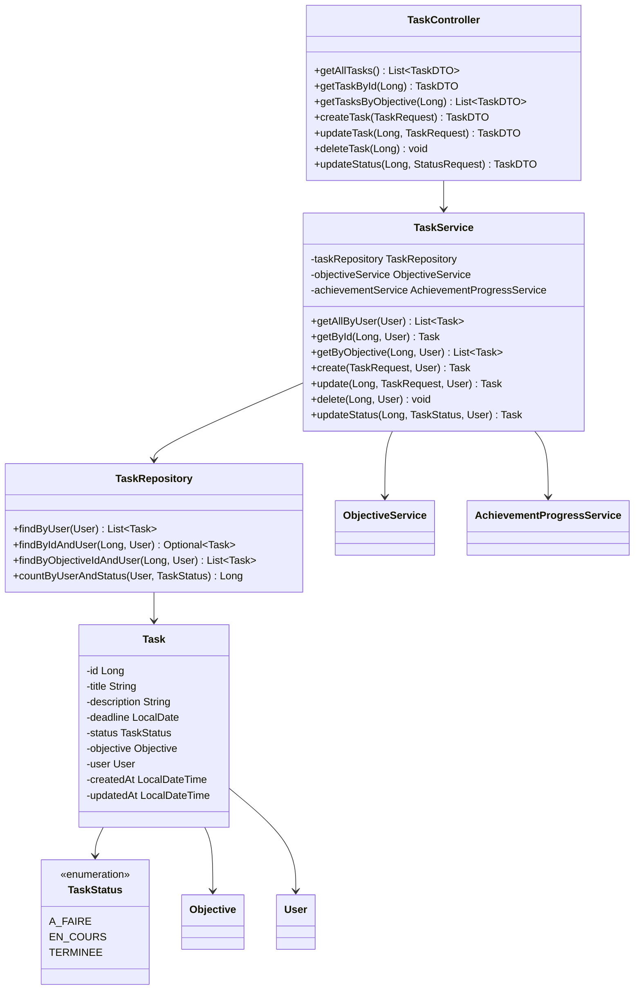
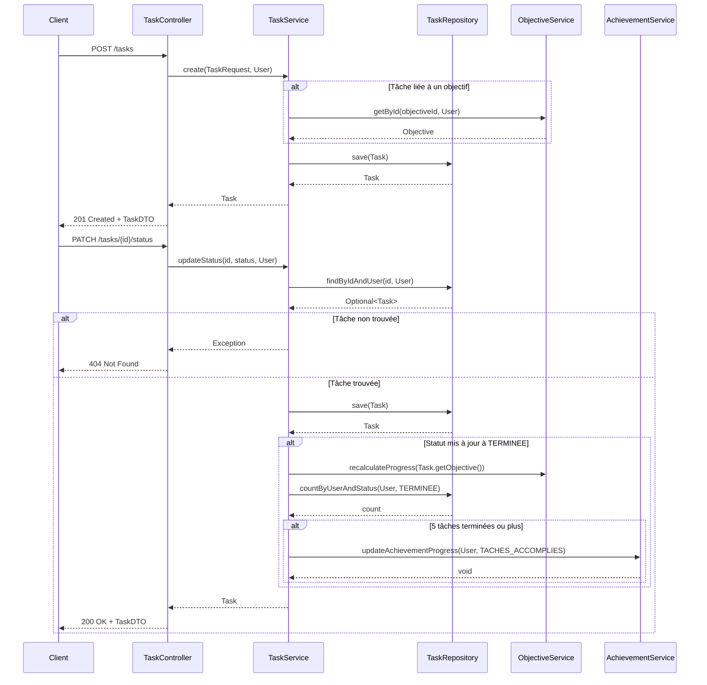

# Service de Gestion des Tâches

*Développé par : Cheikh Ahmed Tidiane Thiandoum & Awaa Ndiaye*

## Vue d'ensemble

Le service de gestion des tâches permet aux utilisateurs de décomposer leurs objectifs en tâches plus petites et gérables. Ce service s'intègre avec le service des objectifs pour mettre à jour automatiquement la progression des objectifs lorsque les tâches sont complétées, et avec le système d'achievements pour récompenser les utilisateurs qui complètent des tâches.

## Architecture



## Flux de Gestion des Tâches



## Points Clés d'Implémentation

### Modèle de Tâche

```java
@Entity
@Table(name = "tasks")
public class Task {
    @Id
    @GeneratedValue(strategy = GenerationType.IDENTITY)
    private Long id;
    
    @NotBlank
    private String title;
    
    private String description;
    
    private LocalDate deadline;
    
    @Enumerated(EnumType.STRING)
    private TaskStatus status = TaskStatus.A_FAIRE;
    
    @ManyToOne
    @JoinColumn(name = "objective_id")
    private Objective objective;
    
    @ManyToOne
    @JoinColumn(name = "user_id", nullable = false)
    private User user;
    
    @CreationTimestamp
    private LocalDateTime createdAt;
    
    @UpdateTimestamp
    private LocalDateTime updatedAt;
    
    // Getters, setters, etc.
}
```

### Mise à Jour du Statut et Impact sur les Objectifs

Lorsque le statut d'une tâche est mis à jour, la progression de l'objectif associé est recalculée automatiquement :

```java
public Task updateStatus(Long id, TaskStatus status, User user) {
    Task task = getById(id, user);
    TaskStatus oldStatus = task.getStatus();
    task.setStatus(status);
    
    Task updatedTask = taskRepository.save(task);
    
    // Si le statut a changé à TERMINEE ou depuis TERMINEE, recalculer la progression de l'objectif
    if ((status == TaskStatus.TERMINEE && oldStatus != TaskStatus.TERMINEE) || 
        (status != TaskStatus.TERMINEE && oldStatus == TaskStatus.TERMINEE)) {
        
        if (task.getObjective() != null) {
            objectiveService.recalculateProgress(task.getObjective());
        }
        
        // Vérification pour l'achievement "Tâches accomplies"
        if (status == TaskStatus.TERMINEE) {
            long completedTasksCount = taskRepository.countByUserAndStatus(user, TaskStatus.TERMINEE);
            if (completedTasksCount >= 5) {
                achievementService.updateAchievementProgress(user, AchievementType.TACHES_ACCOMPLIES);
            }
        }
    }
    
    return updatedTask;
}
```

### Intégration avec le Système d'Achievements

Le service de tâches interagit avec le système d'achievements pour débloquer l'achievement "Tâches accomplies" lorsque l'utilisateur a terminé 5 tâches :

```java
private void checkTasksAchievement(User user) {
    long completedTasksCount = taskRepository.countByUserAndStatus(user, TaskStatus.TERMINEE);
    if (completedTasksCount >= 5) {
        achievementService.updateAchievementProgress(user, AchievementType.TACHES_ACCOMPLIES);
    }
}
```

## Endpoints API

| Méthode | Endpoint | Description | Paramètres | Réponse |
|---------|----------|-------------|------------|---------|
| GET | `/api/tasks` | Récupérer toutes les tâches de l'utilisateur | - | Liste de TaskDTO |
| GET | `/api/tasks/{id}` | Récupérer une tâche par son ID | `id` dans le chemin | TaskDTO |
| GET | `/api/tasks/objective/{objectiveId}` | Récupérer les tâches d'un objectif | `objectiveId` dans le chemin | Liste de TaskDTO |
| POST | `/api/tasks` | Créer une nouvelle tâche | TaskRequest (title, description, deadline, objectiveId) | TaskDTO |
| PUT | `/api/tasks/{id}` | Mettre à jour une tâche | `id` dans le chemin, TaskRequest | TaskDTO |
| DELETE | `/api/tasks/{id}` | Supprimer une tâche | `id` dans le chemin | - |
| PATCH | `/api/tasks/{id}/status` | Mettre à jour le statut | `id` dans le chemin, StatusRequest (status) | TaskDTO |

## Défis et Solutions

### Défi : Cohérence entre Tâches et Objectifs

**Solution :** Implémentation d'un mécanisme de mise à jour automatique de la progression des objectifs lorsque le statut des tâches change, garantissant ainsi la cohérence des données.

### Défi : Gestion des Tâches Orphelines

**Solution :** Conception permettant de créer des tâches indépendantes (sans objectif associé) tout en maintenant la possibilité de les lier ultérieurement à un objectif.

## Améliorations Futures

1. Ajout de sous-tâches pour une décomposition plus fine
2. Système de priorités pour les tâches
3. Fonctionnalité de tâches récurrentes
4. Estimation du temps nécessaire pour accomplir une tâche
5. Système de rappels et notifications pour les tâches dont la deadline approche
