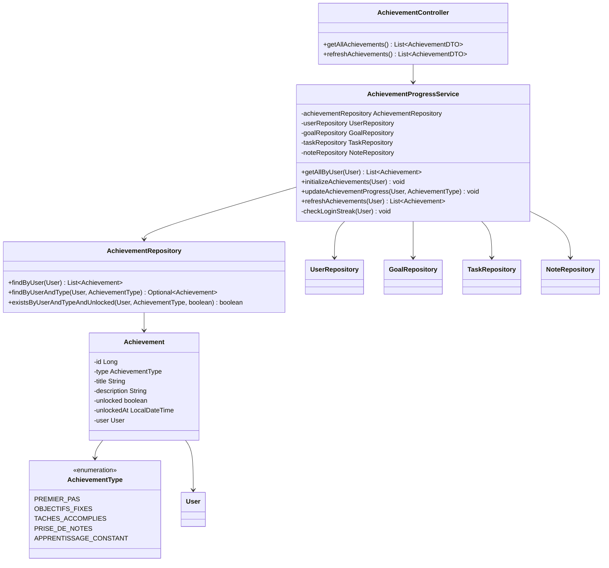
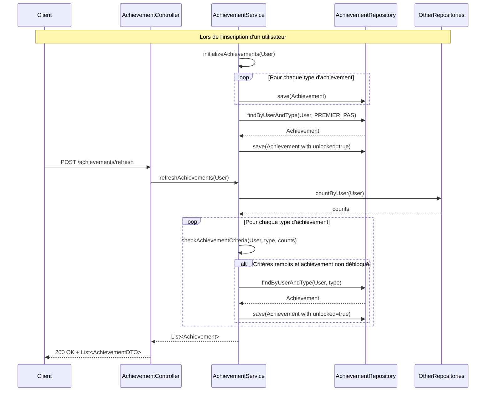

# Service de Gestion des Achievements

*Développé par : Cheikh Ahmed Tidiane Thiandoum & Awaa Ndiaye*

## Vue d'ensemble

Le service de gestion des achievements est un composant motivationnel clé de l'application Skill-Up. Il récompense les utilisateurs pour leurs actions sur la plateforme, les encourageant à utiliser régulièrement l'application et à progresser dans leur développement personnel. Ce service s'intègre avec tous les autres services pour suivre les actions des utilisateurs et débloquer les achievements correspondants.

## Architecture



## Flux de Gestion des Achievements



## Points Clés d'Implémentation

### Modèle d'Achievement

```java
@Entity
@Table(name = "achievements")
public class Achievement {
    @Id
    @GeneratedValue(strategy = GenerationType.IDENTITY)
    private Long id;
    
    @Enumerated(EnumType.STRING)
    private AchievementType type;
    
    private String title;
    
    private String description;
    
    private boolean unlocked = false;
    
    private LocalDateTime unlockedAt;
    
    @ManyToOne
    @JoinColumn(name = "user_id", nullable = false)
    private User user;
    
    // Getters, setters, etc.
}
```

### Initialisation des Achievements

Lors de l'inscription d'un utilisateur, tous les achievements sont initialisés, et "Premier pas" est automatiquement débloqué :

```java
public void initializeAchievements(User user) {
    // Création des achievements pour le nouvel utilisateur
    createAchievement(user, AchievementType.PREMIER_PAS, "Premier pas", 
                     "Bienvenue dans Skill-Up ! Vous avez fait le premier pas vers votre développement personnel.");
    
    createAchievement(user, AchievementType.OBJECTIFS_FIXES, "Objectifs fixés", 
                     "Vous avez créé votre premier objectif. Continuez à définir vos ambitions !");
    
    createAchievement(user, AchievementType.TACHES_ACCOMPLIES, "Tâches accomplies", 
                     "Vous avez complété 5 tâches. Votre productivité est impressionnante !");
    
    createAchievement(user, AchievementType.PRISE_DE_NOTES, "Prise de notes", 
                     "Vous avez créé 10 notes. Votre documentation est en bonne voie !");
    
    createAchievement(user, AchievementType.APPRENTISSAGE_CONSTANT, "Apprentissage constant", 
                     "Vous vous êtes connecté 7 jours de suite. Votre constance est admirable !");
    
    // Déblocage automatique de l'achievement "Premier pas"
    updateAchievementProgress(user, AchievementType.PREMIER_PAS);
}

private void createAchievement(User user, AchievementType type, String title, String description) {
    Achievement achievement = new Achievement();
    achievement.setUser(user);
    achievement.setType(type);
    achievement.setTitle(title);
    achievement.setDescription(description);
    achievementRepository.save(achievement);
}
```

### Mise à Jour des Achievements

Le service central qui gère la mise à jour des achievements en fonction des actions des utilisateurs :

```java
public void updateAchievementProgress(User user, AchievementType type) {
    Achievement achievement = achievementRepository.findByUserAndType(user, type)
            .orElseThrow(() -> new ResourceNotFoundException("Achievement not found"));
    
    if (!achievement.isUnlocked()) {
        achievement.setUnlocked(true);
        achievement.setUnlockedAt(LocalDateTime.now());
        achievementRepository.save(achievement);
    }
}
```

### Rafraîchissement des Achievements

Endpoint permettant de rafraîchir manuellement les achievements d'un utilisateur :

```java
public List<Achievement> refreshAchievements(User user) {
    // Vérification pour "Objectifs fixés"
    long goalCount = goalRepository.countByUser(user);
    if (goalCount > 0) {
        updateAchievementProgress(user, AchievementType.OBJECTIFS_FIXES);
    }
    
    // Vérification pour "Tâches accomplies"
    long completedTasksCount = taskRepository.countByUserAndStatus(user, TaskStatus.TERMINEE);
    if (completedTasksCount >= 5) {
        updateAchievementProgress(user, AchievementType.TACHES_ACCOMPLIES);
    }
    
    // Vérification pour "Prise de notes"
    long notesCount = noteRepository.countByUser(user);
    if (notesCount >= 10) {
        updateAchievementProgress(user, AchievementType.PRISE_DE_NOTES);
    }
    
    // Vérification pour "Apprentissage constant"
    checkLoginStreak(user);
    
    return achievementRepository.findByUser(user);
}

private void checkLoginStreak(User user) {
    // Logique pour vérifier si l'utilisateur s'est connecté 7 jours de suite
    // Cette logique dépend de la façon dont les connexions sont enregistrées
    // ...
    
    // Si la condition est remplie
    // updateAchievementProgress(user, AchievementType.APPRENTISSAGE_CONSTANT);
}
```

## Endpoints API

| Méthode | Endpoint | Description | Paramètres | Réponse |
|---------|----------|-------------|------------|---------|
| GET | `/api/achievements` | Récupérer tous les achievements de l'utilisateur | - | Liste d'AchievementDTO |
| POST | `/api/achievements/refresh` | Rafraîchir manuellement les achievements | - | Liste d'AchievementDTO |

## Défis et Solutions

### Défi : Suivi des Connexions Consécutives

**Solution :** Implémentation d'un mécanisme de suivi des dates de connexion des utilisateurs, avec mise à jour lors de chaque authentification réussie.

### Défi : Intégration avec les Autres Services

**Solution :** Conception d'un service central d'achievements qui s'intègre avec tous les autres services sans créer de dépendances circulaires, en utilisant des événements ou des appels directs selon les cas.

## Améliorations Futures

1. Ajout de nouveaux types d'achievements pour encourager d'autres comportements
2. Système de niveaux basé sur les achievements débloqués
3. Récompenses virtuelles ou badges visuels pour les achievements
4. Tableau de classement des utilisateurs basé sur les achievements
5. Notifications en temps réel lors du déblocage d'un achievement
