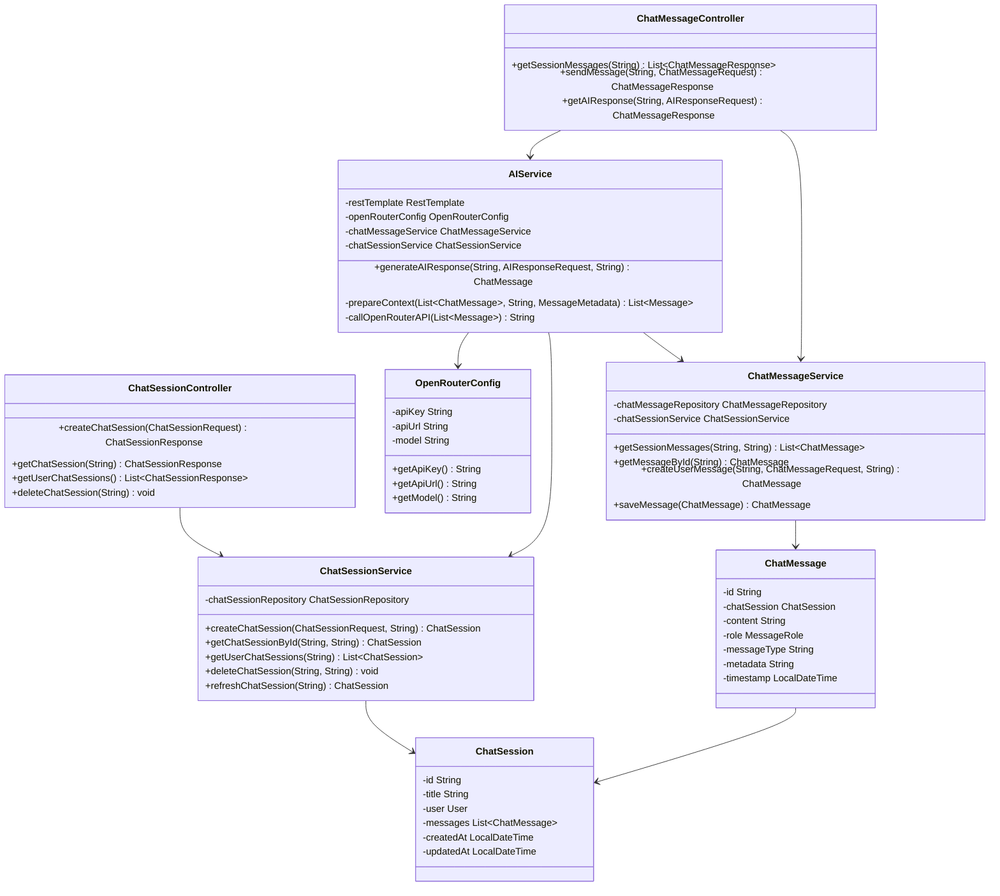
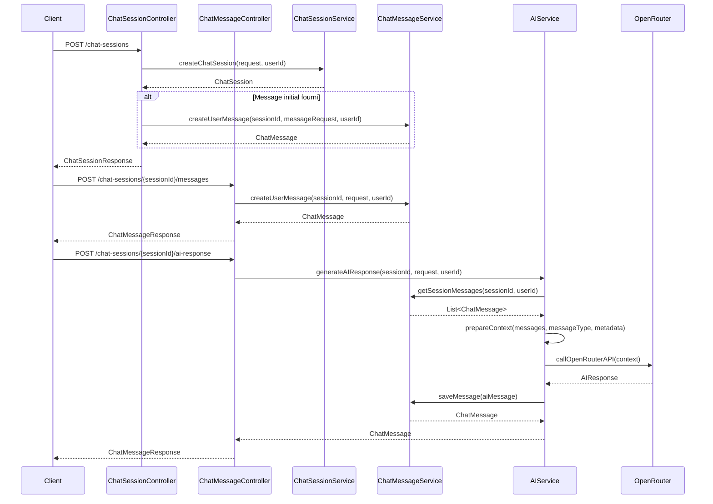

# Service de Chat avec Intelligence Artificielle

*Développé par : Cheikh Ahmed Tidiane Thiandoum & Awaa Ndiaye*

## Vue d'ensemble

Le service de chat est une fonctionnalité avancée de l'application Skill-Up qui permet aux utilisateurs d'interagir avec une intelligence artificielle pour obtenir de l'aide, des conseils ou générer du contenu en lien avec leur développement personnel et leurs apprentissages. Ce service s'intègre avec OpenRouter pour fournir des réponses IA pertinentes et contextuelles.

## Architecture



## Flux d'Interaction avec le Chat IA



## Points Clés d'Implémentation

### Configuration d'OpenRouter

Le service utilise OpenRouter comme fournisseur d'IA pour générer des réponses pertinentes. La configuration est gérée via la classe `OpenRouterConfig` :

```java
@Configuration
public class OpenRouterConfig {

    @Value("${openrouter.api.key:}")
    private String apiKey;

    @Value("${openrouter.api.url:https://openrouter.ai/api/v1}")
    private String apiUrl;

    @Value("${openrouter.model:google/gemma-3n-e4b-it:free}")
    private String model;

    @Bean
    public RestTemplate restTemplate() {
        return new RestTemplate();
    }

    // Getters
}
```

### Modèle de Session de Chat

```java
@Entity
@Table(name = "chat_sessions")
public class ChatSession {
    @Id
    private String id;
    
    private String title;
    
    @ManyToOne
    @JoinColumn(name = "user_id", nullable = false)
    private User user;
    
    @OneToMany(mappedBy = "chatSession", cascade = CascadeType.ALL, fetch = FetchType.LAZY)
    @OrderBy("timestamp ASC")
    private List<ChatMessage> messages;
    
    private LocalDateTime createdAt;
    
    private LocalDateTime updatedAt;
    
    // Getters, setters, etc.
}
```

### Modèle de Message de Chat

```java
@Entity
@Table(name = "chat_messages")
public class ChatMessage {
    @Id
    private String id;
    
    @ManyToOne
    @JoinColumn(name = "chat_session_id", nullable = false)
    private ChatSession chatSession;
    
    @Column(columnDefinition = "TEXT")
    private String content;
    
    @Enumerated(EnumType.STRING)
    private MessageRole role;
    
    private String messageType;
    
    @Column(columnDefinition = "TEXT")
    private String metadata;
    
    private LocalDateTime timestamp;
    
    public enum MessageRole {
        user, assistant, system
    }
    
    // Getters, setters, etc.
}
```

### Service d'Intelligence Artificielle

Le service AI est responsable de la génération de réponses intelligentes en utilisant l'API OpenRouter :

```java
@Service
public class AIService {
    // ...
    
    @Transactional
    public ChatMessage generateAIResponse(String sessionId, AIResponseRequest request, String userId) {
        // Vérifier l'accès à la session
        ChatSession chatSession = chatSessionService.getChatSessionById(sessionId, userId);
        
        // Récupérer le message de l'utilisateur
        ChatMessage userMessage = chatMessageService.getMessageById(request.getMessageId());
        
        // Récupérer le contexte de la conversation
        List<ChatMessage> sessionMessages = chatMessageService.getSessionMessages(sessionId, userId);
        
        // Préparer le contexte pour l'IA
        List<Message> context = prepareContext(sessionMessages, userMessage.getMessageType(), metadata);
        
        // Appeler l'API OpenRouter
        String aiResponse = callOpenRouterAPI(context);
        
        // Créer et sauvegarder le message de l'IA
        ChatMessage aiMessage = ChatMessage.builder()
                .chatSession(chatSession)
                .content(aiResponse)
                .role(ChatMessage.MessageRole.assistant)
                .build();
                
        return chatMessageService.saveMessage(aiMessage);
    }
    
    // Autres méthodes...
}
```

### Préparation du Contexte Intelligent

Une caractéristique clé du service est sa capacité à préparer intelligemment le contexte pour l'IA en fonction du type de message et des métadonnées :

```java
private List<Message> prepareContext(List<ChatMessage> messages, String messageType, ChatMessageRequest.MessageMetadata metadata) {
    List<Message> context = new ArrayList<>();
    
    // Ajouter un message système initial pour définir le rôle de l'IA
    context.add(new Message("system", "Tu es un assistant intelligent qui aide les utilisateurs dans leur développement personnel et leur apprentissage."));
    
    // Traitement spécial selon le type de message
    if (messageType != null && metadata != null) {
        switch (messageType) {
            case "objective_help":
                // Contexte pour l'aide à la définition d'objectifs
                StringBuilder objectivePrompt = new StringBuilder();
                objectivePrompt.append("Tu es un coach spécialisé dans la définition d'objectifs SMART. ");
                // ...
                context.add(new Message("system", objectivePrompt.toString()));
                return context;
                
            case "note_quiz":
                // Contexte pour la génération de quiz basés sur des notes
                StringBuilder quizPrompt = new StringBuilder();
                quizPrompt.append("Tu es un assistant qui crée des quiz basés sur des notes. ");
                // ...
                context.add(new Message("system", quizPrompt.toString()));
                return context;
        }
    }
    
    // Gestion des conversations longues
    if (messages.size() > 10) {
        // Résumer les anciens messages pour économiser des tokens
        // ...
    } else {
        // Ajouter tous les messages pour les conversations courtes
        // ...
    }
    
    return context;
}
```

## Endpoints API

| Méthode | Endpoint | Description | Paramètres | Réponse |
|---------|----------|-------------|------------|---------|
| POST | `/chat-sessions` | Créer une nouvelle session de chat | ChatSessionRequest (title, initialMessage) | ChatSessionResponse |
| GET | `/chat-sessions` | Récupérer toutes les sessions de chat de l'utilisateur | - | Liste de ChatSessionResponse |
| GET | `/chat-sessions/{id}` | Récupérer une session de chat par son ID | `id` dans le chemin | ChatSessionResponse |
| DELETE | `/chat-sessions/{id}` | Supprimer une session de chat | `id` dans le chemin | Message de confirmation |
| GET | `/chat-sessions/{sessionId}/messages` | Récupérer tous les messages d'une session | `sessionId` dans le chemin | Liste de ChatMessageResponse |
| POST | `/chat-sessions/{sessionId}/messages` | Envoyer un message utilisateur | `sessionId` dans le chemin, ChatMessageRequest | ChatMessageResponse |
| POST | `/chat-sessions/{sessionId}/ai-response` | Obtenir une réponse IA | `sessionId` dans le chemin, AIResponseRequest (messageId) | ChatMessageResponse |

## Types de Messages Spéciaux

Le service de chat prend en charge différents types de messages spéciaux pour des cas d'utilisation spécifiques :

### 1. Aide à la Définition d'Objectifs (`objective_help`)

Ce type de message permet à l'IA de fournir des conseils personnalisés pour la définition d'objectifs SMART (Spécifiques, Mesurables, Atteignables, Réalistes, Temporels).

**Exemple de métadonnées :**
```json
{
  "objectiveTitle": "Apprendre Python",
  "objectiveDescription": "Je souhaite apprendre les bases de Python pour l'analyse de données",
  "timeframe": "3 mois"
}
```

### 2. Génération de Quiz (`note_quiz`)

Ce type de message permet à l'IA de générer des quiz basés sur les notes de l'utilisateur pour faciliter l'apprentissage.

**Exemple de métadonnées :**
```json
{
  "noteTitle": "Introduction à JavaScript",
  "noteContent": "JavaScript est un langage de programmation qui permet d'implémenter des mécanismes complexes sur une page web..."
}
```

### 3. Résumé de Contenu (`content_summary`)

Ce type de message permet à l'IA de résumer du contenu pour l'utilisateur.

**Exemple de métadonnées :**
```json
{
  "contentType": "article",
  "content": "Le texte complet de l'article à résumer..."
}
```

## Défis et Solutions

### Défi : Gestion du Contexte de Conversation

**Solution :** Implémentation d'un mécanisme intelligent de préparation du contexte qui résume les anciens messages pour les conversations longues tout en préservant le contexte essentiel.

### Défi : Intégration avec OpenRouter

**Solution :** Création d'une configuration flexible qui permet de changer facilement de modèle d'IA ou de fournisseur via des propriétés d'application.

### Défi : Types de Messages Spécialisés

**Solution :** Conception d'un système extensible de types de messages avec métadonnées qui permet d'adapter le comportement de l'IA selon le cas d'utilisation.

## Améliorations Futures

1. Support de la génération d'images via des modèles multimodaux
2. Intégration de la recherche vectorielle pour permettre à l'IA d'accéder aux notes et objectifs de l'utilisateur
3. Personnalisation de l'IA en fonction du profil et des préférences de l'utilisateur
4. Système de feedback pour améliorer les réponses de l'IA
5. Support de l'upload de fichiers pour analyse par l'IA
