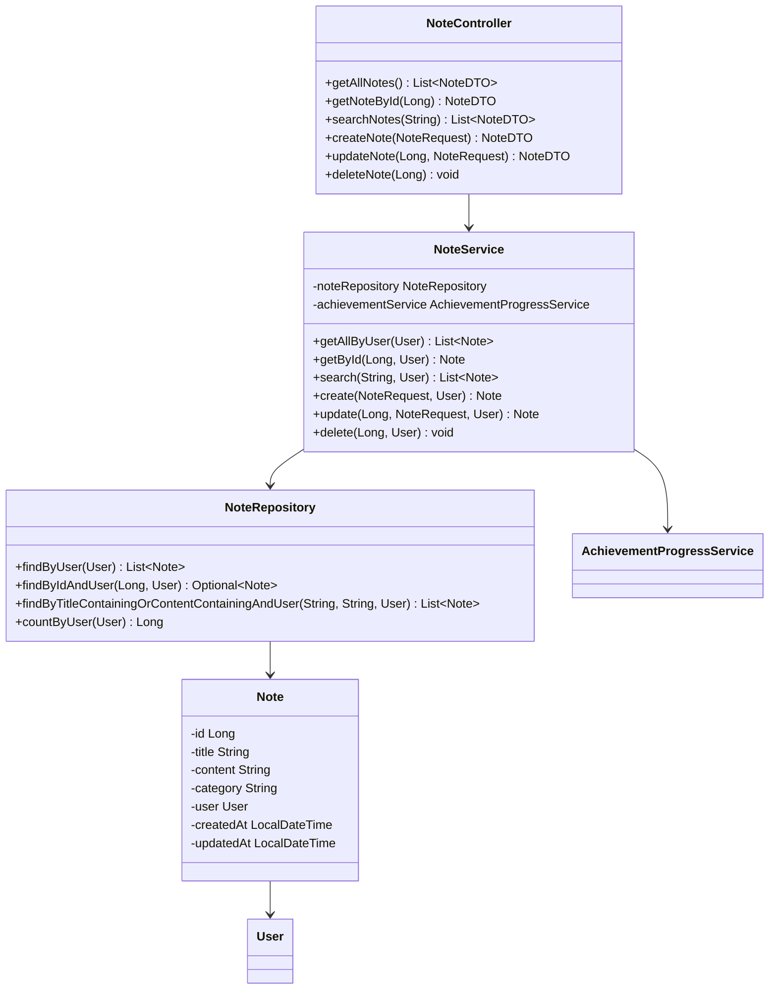
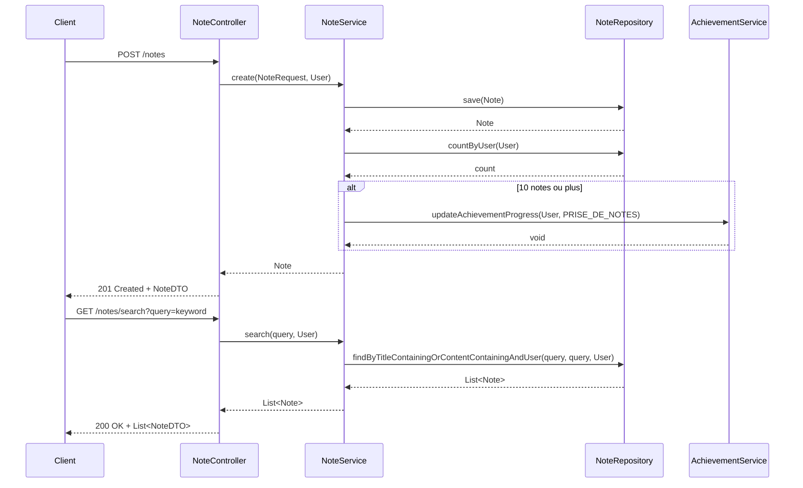

# Service de Gestion des Notes

*Développé par : Cheikh Ahmed Tidiane Thiandoum & Awaa Ndiaye*

## Vue d'ensemble

Le service de gestion des notes permet aux utilisateurs de documenter leur apprentissage, de prendre des notes sur leurs projets et de sauvegarder des informations importantes. Ce service s'intègre avec le système d'achievements pour récompenser les utilisateurs qui créent régulièrement des notes.

## Architecture



## Flux de Gestion des Notes



## Points Clés d'Implémentation

### Modèle de Note

```java
@Entity
@Table(name = "notes")
public class Note {
    @Id
    @GeneratedValue(strategy = GenerationType.IDENTITY)
    private Long id;
    
    @NotBlank
    private String title;
    
    @Column(columnDefinition = "TEXT")
    private String content;
    
    private String category;
    
    @ManyToOne
    @JoinColumn(name = "user_id", nullable = false)
    private User user;
    
    @CreationTimestamp
    private LocalDateTime createdAt;
    
    @UpdateTimestamp
    private LocalDateTime updatedAt;
    
    // Getters, setters, etc.
}
```

### Recherche de Notes

Le service permet de rechercher des notes par mots-clés dans le titre ou le contenu :

```java
public List<Note> search(String query, User user) {
    return noteRepository.findByTitleContainingOrContentContainingAndUser(
        query, query, user
    );
}
```

### Intégration avec le Système d'Achievements

Le service de notes interagit avec le système d'achievements pour débloquer l'achievement "Prise de notes" lorsque l'utilisateur a créé 10 notes :

```java
public Note create(NoteRequest request, User user) {
    Note note = new Note();
    note.setTitle(request.getTitle());
    note.setContent(request.getContent());
    note.setCategory(request.getCategory());
    note.setUser(user);
    
    Note savedNote = noteRepository.save(note);
    
    // Vérification pour l'achievement "Prise de notes"
    long notesCount = noteRepository.countByUser(user);
    if (notesCount >= 10) {
        achievementService.updateAchievementProgress(user, AchievementType.PRISE_DE_NOTES);
    }
    
    return savedNote;
}
```

## Endpoints API

| Méthode | Endpoint | Description | Paramètres | Réponse |
|---------|----------|-------------|------------|---------|
| GET | `/api/notes` | Récupérer toutes les notes de l'utilisateur | - | Liste de NoteDTO |
| GET | `/api/notes/{id}` | Récupérer une note par son ID | `id` dans le chemin | NoteDTO |
| GET | `/api/notes/search` | Rechercher des notes par mots-clés | `query` en paramètre de requête | Liste de NoteDTO |
| POST | `/api/notes` | Créer une nouvelle note | NoteRequest (title, content, category) | NoteDTO |
| PUT | `/api/notes/{id}` | Mettre à jour une note | `id` dans le chemin, NoteRequest | NoteDTO |
| DELETE | `/api/notes/{id}` | Supprimer une note | `id` dans le chemin | - |

## Défis et Solutions

### Défi : Stockage Efficace du Contenu

**Solution :** Utilisation du type de colonne TEXT pour stocker le contenu des notes, permettant ainsi de gérer des notes de taille variable sans limitation de longueur.

### Défi : Recherche Performante

**Solution :** Implémentation d'une recherche textuelle simple dans un premier temps, avec possibilité d'évoluer vers une solution plus avancée comme Elasticsearch pour les grandes quantités de données.

## Améliorations Futures

1. Support du format Markdown pour le contenu des notes
2. Système de tags plus avancé pour une meilleure organisation
3. Possibilité de joindre des fichiers aux notes
4. Partage de notes entre utilisateurs
5. Système de versions pour suivre l'évolution des notes dans le temps
