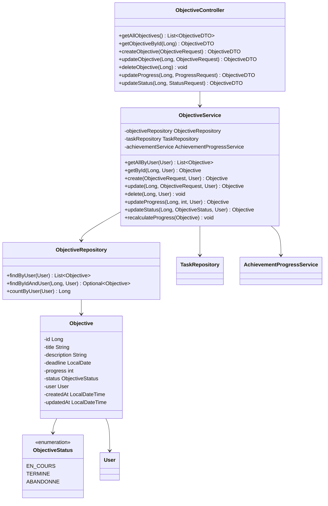
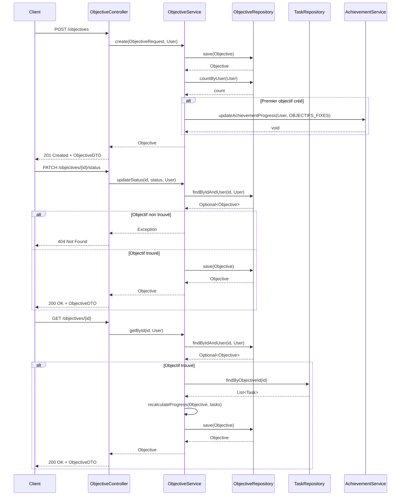

# Service de Gestion des Objectifs

*Développé par : Cheikh Ahmed Tidiane Thiandoum & Awaa Ndiaye*

## Vue d'ensemble

Le service de gestion des objectifs est un composant central de l'application Skill-Up. Il permet aux utilisateurs de définir, suivre et gérer leurs objectifs personnels ou professionnels. Ce service s'intègre étroitement avec le service de gestion des tâches et le système d'achievements.

## Architecture



## Flux de Gestion des Objectifs



## Points Clés d'Implémentation

### Modèle d'Objectif

```java
@Entity
@Table(name = "objectives")
public class Objective {
    @Id
    @GeneratedValue(strategy = GenerationType.IDENTITY)
    private Long id;
    
    @NotBlank
    private String title;
    
    private String description;
    
    private LocalDate deadline;
    
    private int progress = 0;
    
    @Enumerated(EnumType.STRING)
    private ObjectiveStatus status = ObjectiveStatus.EN_COURS;
    
    @ManyToOne
    @JoinColumn(name = "user_id", nullable = false)
    private User user;
    
    @CreationTimestamp
    private LocalDateTime createdAt;
    
    @UpdateTimestamp
    private LocalDateTime updatedAt;
    
    // Getters, setters, etc.
}
```

### Calcul Automatique de la Progression

Le service recalcule automatiquement la progression d'un objectif en fonction de l'état des tâches associées :

```java
public void recalculateProgress(Objective objective) {
    List<Task> tasks = taskRepository.findByObjectiveId(objective.getId());
    
    if (tasks.isEmpty()) {
        objective.setProgress(0);
        return;
    }
    
    long completedTasks = tasks.stream()
            .filter(task -> task.getStatus() == TaskStatus.TERMINEE)
            .count();
    
    int newProgress = (int) ((completedTasks * 100) / tasks.size());
    objective.setProgress(newProgress);
    
    // Mise à jour automatique du statut si toutes les tâches sont terminées
    if (newProgress == 100 && objective.getStatus() == ObjectiveStatus.EN_COURS) {
        objective.setStatus(ObjectiveStatus.TERMINE);
    }
    
    objectiveRepository.save(objective);
}
```

### Intégration avec le Système d'Achievements

Lors de la création du premier objectif, l'achievement "Objectifs fixés" est débloqué :

```java
public Objective create(ObjectiveRequest request, User user) {
    Objective objective = new Objective();
    objective.setTitle(request.getTitle());
    objective.setDescription(request.getDescription());
    objective.setDeadline(request.getDeadline());
    objective.setUser(user);
    
    Objective savedObjective = objectiveRepository.save(objective);
    
    // Vérification pour l'achievement "Objectifs fixés"
    long objectiveCount = objectiveRepository.countByUser(user);
    if (objectiveCount == 1) {
        achievementService.updateAchievementProgress(user, AchievementType.OBJECTIFS_FIXES);
    }
    
    return savedObjective;
}
```

## Endpoints API

| Méthode | Endpoint | Description | Paramètres | Réponse |
|---------|----------|-------------|------------|---------|
| GET | `/api/objectives` | Récupérer tous les objectifs de l'utilisateur | - | Liste d'ObjectiveDTO |
| GET | `/api/objectives/{id}` | Récupérer un objectif par son ID | `id` dans le chemin | ObjectiveDTO |
| POST | `/api/objectives` | Créer un nouvel objectif | ObjectiveRequest (title, description, deadline) | ObjectiveDTO |
| PUT | `/api/objectives/{id}` | Mettre à jour un objectif | `id` dans le chemin, ObjectiveRequest | ObjectiveDTO |
| DELETE | `/api/objectives/{id}` | Supprimer un objectif | `id` dans le chemin | - |
| PATCH | `/api/objectives/{id}/progress` | Mettre à jour la progression | `id` dans le chemin, ProgressRequest (progress) | ObjectiveDTO |
| PATCH | `/api/objectives/{id}/status` | Mettre à jour le statut | `id` dans le chemin, StatusRequest (status) | ObjectiveDTO |

## Défis et Solutions

### Défi : Synchronisation avec les Tâches

**Solution :** Implémentation d'un mécanisme de recalcul automatique de la progression des objectifs lorsque l'état des tâches associées change.

### Défi : Gestion des Deadlines

**Solution :** Utilisation de LocalDate pour gérer les dates d'échéance et implémentation de validations pour s'assurer que les deadlines sont dans le futur.

## Améliorations Futures

1. Système de rappels pour les objectifs dont la deadline approche
2. Catégorisation des objectifs (personnel, professionnel, éducation, etc.)
3. Possibilité de définir des objectifs récurrents
4. Visualisation graphique de la progression des objectifs dans le temps
