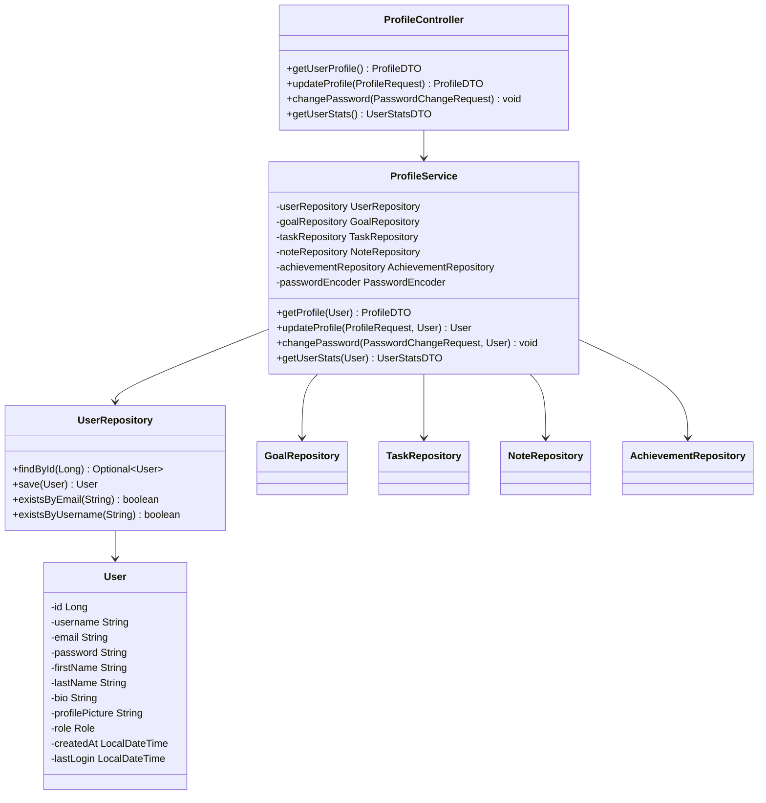
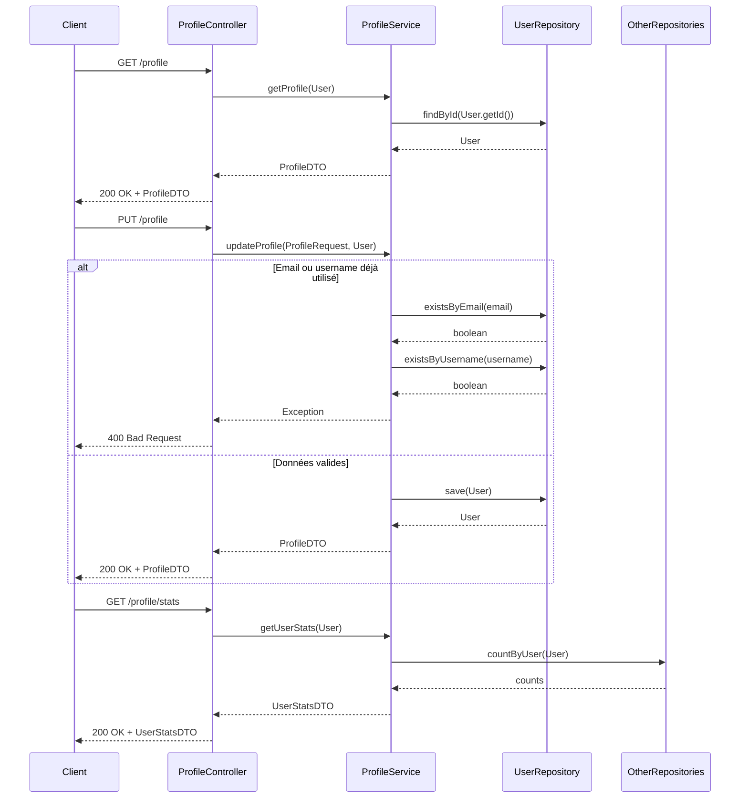

# Service de Gestion du Profil Utilisateur

*Développé par : Cheikh Ahmed Tidiane Thiandoum & Awaa Ndiaye*

## Vue d'ensemble

Le service de gestion du profil utilisateur permet aux utilisateurs de gérer leurs informations personnelles, de personnaliser leur expérience et de suivre leurs statistiques d'utilisation de l'application. Ce service s'intègre avec les autres services pour fournir une vue consolidée des activités de l'utilisateur.

## Architecture



## Flux de Gestion du Profil



## Points Clés d'Implémentation

### Modèle Utilisateur Étendu

```java
@Entity
@Table(name = "users")
public class User implements UserDetails {
    @Id
    @GeneratedValue(strategy = GenerationType.IDENTITY)
    private Long id;
    
    @Column(unique = true, nullable = false)
    private String username;
    
    @Column(unique = true, nullable = false)
    private String email;
    
    @Column(nullable = false)
    private String password;
    
    private String firstName;
    
    private String lastName;
    
    @Column(columnDefinition = "TEXT")
    private String bio;
    
    private String profilePicture;
    
    @Enumerated(EnumType.STRING)
    private Role role = Role.USER;
    
    @CreationTimestamp
    private LocalDateTime createdAt;
    
    private LocalDateTime lastLogin;
    
    // Implémentation des méthodes UserDetails
    
    @Override
    public Collection<? extends GrantedAuthority> getAuthorities() {
        return List.of(new SimpleGrantedAuthority("ROLE_" + role.name()));
    }
    
    @Override
    public boolean isAccountNonExpired() {
        return true;
    }
    
    @Override
    public boolean isAccountNonLocked() {
        return true;
    }
    
    @Override
    public boolean isCredentialsNonExpired() {
        return true;
    }
    
    @Override
    public boolean isEnabled() {
        return true;
    }
    
    // Getters, setters, etc.
}
```

### Mise à Jour du Profil

```java
public User updateProfile(ProfileRequest request, User currentUser) {
    // Vérification si l'email est déjà utilisé par un autre utilisateur
    if (!request.getEmail().equals(currentUser.getEmail()) && 
        userRepository.existsByEmail(request.getEmail())) {
        throw new DuplicateResourceException("Email already in use");
    }
    
    // Vérification si le username est déjà utilisé par un autre utilisateur
    if (!request.getUsername().equals(currentUser.getUsername()) && 
        userRepository.existsByUsername(request.getUsername())) {
        throw new DuplicateResourceException("Username already in use");
    }
    
    // Mise à jour des informations
    currentUser.setUsername(request.getUsername());
    currentUser.setEmail(request.getEmail());
    currentUser.setFirstName(request.getFirstName());
    currentUser.setLastName(request.getLastName());
    currentUser.setBio(request.getBio());
    
    // Gestion de l'image de profil (si implémentée)
    if (request.getProfilePicture() != null) {
        // Logique pour sauvegarder l'image de profil
        // ...
        currentUser.setProfilePicture(savedImagePath);
    }
    
    return userRepository.save(currentUser);
}
```

### Changement de Mot de Passe

```java
public void changePassword(PasswordChangeRequest request, User currentUser) {
    // Vérification de l'ancien mot de passe
    if (!passwordEncoder.matches(request.getCurrentPassword(), currentUser.getPassword())) {
        throw new InvalidCredentialsException("Current password is incorrect");
    }
    
    // Vérification que le nouveau mot de passe est différent de l'ancien
    if (passwordEncoder.matches(request.getNewPassword(), currentUser.getPassword())) {
        throw new InvalidRequestException("New password must be different from current password");
    }
    
    // Mise à jour du mot de passe
    currentUser.setPassword(passwordEncoder.encode(request.getNewPassword()));
    userRepository.save(currentUser);
}
```

### Statistiques Utilisateur

```java
public UserStatsDTO getUserStats(User user) {
    UserStatsDTO stats = new UserStatsDTO();
    
    // Nombre total d'objectifs
    long totalObjectives = goalRepository.countByUser(user);
    stats.setTotalObjectives(totalObjectives);
    
    // Nombre d'objectifs terminés
    long completedObjectives = goalRepository.countByUserAndStatus(user, ObjectiveStatus.TERMINE);
    stats.setCompletedObjectives(completedObjectives);
    
    // Taux de complétion des objectifs
    double objectiveCompletionRate = totalObjectives > 0 ? 
        (double) completedObjectives / totalObjectives * 100 : 0;
    stats.setObjectiveCompletionRate(objectiveCompletionRate);
    
    // Nombre total de tâches
    long totalTasks = taskRepository.countByUser(user);
    stats.setTotalTasks(totalTasks);
    
    // Nombre de tâches terminées
    long completedTasks = taskRepository.countByUserAndStatus(user, TaskStatus.TERMINEE);
    stats.setCompletedTasks(completedTasks);
    
    // Taux de complétion des tâches
    double taskCompletionRate = totalTasks > 0 ? 
        (double) completedTasks / totalTasks * 100 : 0;
    stats.setTaskCompletionRate(taskCompletionRate);
    
    // Nombre de notes
    long totalNotes = noteRepository.countByUser(user);
    stats.setTotalNotes(totalNotes);
    
    // Nombre d'achievements débloqués
    long unlockedAchievements = achievementRepository.countByUserAndUnlocked(user, true);
    stats.setUnlockedAchievements(unlockedAchievements);
    
    // Nombre total d'achievements
    long totalAchievements = achievementRepository.countByUser(user);
    stats.setTotalAchievements(totalAchievements);
    
    // Date d'inscription
    stats.setRegistrationDate(user.getCreatedAt());
    
    // Dernière connexion
    stats.setLastLogin(user.getLastLogin());
    
    return stats;
}
```

## Endpoints API

| Méthode | Endpoint | Description | Paramètres | Réponse |
|---------|----------|-------------|------------|---------|
| GET | `/api/profile` | Récupérer le profil de l'utilisateur | - | ProfileDTO |
| PUT | `/api/profile` | Mettre à jour le profil | ProfileRequest (username, email, firstName, lastName, bio) | ProfileDTO |
| POST | `/api/profile/password` | Changer le mot de passe | PasswordChangeRequest (currentPassword, newPassword) | - |
| GET | `/api/profile/stats` | Récupérer les statistiques | - | UserStatsDTO |

## Défis et Solutions

### Défi : Sécurité des Données Personnelles

**Solution :** Validation rigoureuse des entrées utilisateur, protection contre les attaques CSRF, et encodage sécurisé des mots de passe.

### Défi : Gestion des Images de Profil

**Solution :** Implémentation d'un système de stockage d'images avec validation des types de fichiers, redimensionnement automatique, et génération de noms de fichiers uniques.

## Améliorations Futures

1. Intégration avec des services d'authentification externes (Google, Facebook, etc.)
2. Système de vérification d'email
3. Options de confidentialité plus avancées
4. Système de récupération de mot de passe
5. Historique des activités de l'utilisateur
